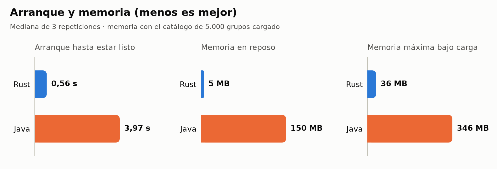
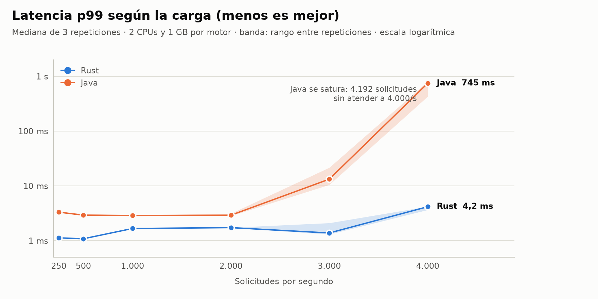
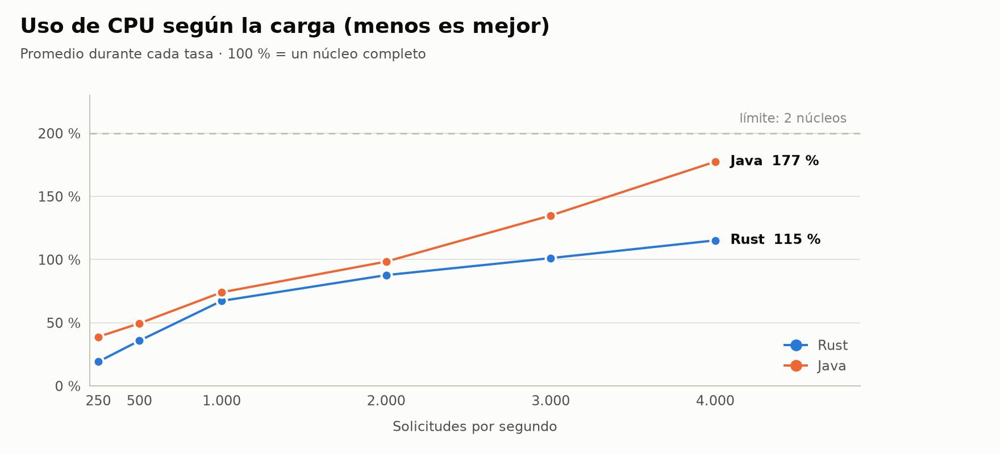
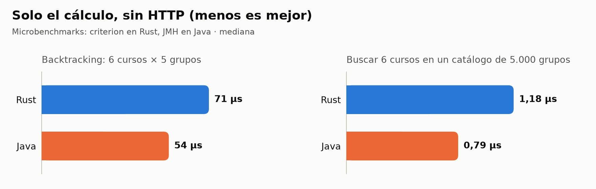

# Comparación de rendimiento: Rust vs Java

Dos implementaciones con **exactamente la misma funcionalidad** (misma arquitectura, mismo
contrato `.proto`, misma API y mismas 21 pruebas), medidas con la misma carga y los mismos
recursos. La versión en Java está en [`java/`](../java/README.md).

## Cómo reproducirlo

```sh
docker compose -f bench/docker-compose.yml build     # imágenes de ambos motores
bench/run.sh                                         # 3 repeticiones, tasas por defecto
REPS=5 RATES="500 1000 2000" DURATION=60s bench/run.sh
```

El resultado queda en `results/report.md`, con el entorno de la corrida al inicio.

Microbenchmarks y gráficas:

```sh
bench/micro.sh                                               # criterion + JMH → results/micro.json
python3 -m venv bench/.venv && bench/.venv/bin/pip install -r bench/requirements.txt   # una vez
bench/.venv/bin/python bench/plot.py bench/results 3 250 500 1000 2000 3000 4000
```

`run.sh` regenera las gráficas al final si el entorno virtual existe. Cada gráfica tiene
versión clara y oscura (`*.png`, `*-dark.png`); los colores se validaron para que se
distingan también con daltonismo.

## Cómo se garantizan condiciones idénticas

| Condición | Cómo se controla |
|---|---|
| Misma funcionalidad | Las mismas 21 pruebas en ambos; responden JSON idéntico a la misma solicitud |
| Mismos datos | Catálogo (5.000 grupos) y 50.000 estudiantes generados con **semilla fija** (`generate_scenario.py`) |
| Mismas solicitudes, en el mismo orden | k6 recorre `students.json` en orden (`iterationInTest`), no elige al azar |
| Mismo punto de partida | Cada corrida arranca desde cero: NATS vacío y **un solo motor encendido** |
| Mismos núcleos | El motor medido corre en las CPUs `4,6`: dos núcleos físicos distintos cuyos hermanos de hiperhilo (5, 7) quedan libres. NATS en `2,3`, k6 en `8-15` |
| Misma memoria | Límite de 1 GB para ambos |
| CPUs que detecta cada motor | Ambos registran al arrancar cuántas CPUs ven (tokio y la JVM dimensionan sus hilos con ese número); el script avisa si no son 2 |
| Sin proxy de puertos | k6 entra por la red interna de Docker (de contenedor a contenedor) |
| Sin sesgo de orden | 3 repeticiones alternando quién va primero (Rust-Java, Java-Rust, Rust-Java); se reporta la **mediana** y el rango del p99 |
| Colas vacías entre tasas | Pausa de 5 s entre una tasa y la siguiente |
| Entorno registrado | Fecha, CPU, kernel, modo de frecuencia, versiones e ID de imágenes, carga del sistema antes de cada corrida |

### Diferencias intencionales

Se compara cada lenguaje **con su stack típico**, así que estas diferencias son parte de lo
medido y no se igualan:

- Framework: axum + tokio frente a Spring Boot 4.1 con hilos virtuales.
- Imagen base: Debian slim frente a Eclipse Temurin (Ubuntu) con la JVM.
- Configuración por defecto de cada ecosistema (sin afinar la JVM ni el asignador de memoria de Rust).

### Recomendaciones antes de medir

- Cerrar programas pesados (navegador, IDE indexando, etc.).
- Poner el procesador en modo `performance` para evitar cambios de frecuencia:
  `sudo cpupower frequency-set -g performance` (el modo usado queda en el reporte).
- Conectar el portátil a la corriente, si aplica.

## Resultados (26-09-2026, mediana de 3 repeticiones)

El reporte completo, con el entorno y el rango de cada métrica, está en
[`results/report.md`](results/report.md).

### Arranque, memoria e imagen

<picture>
  <source media="(prefers-color-scheme: dark)" srcset="results/resources-dark.png">
  
</picture>

| | Rust | Java |
|---|---|---|
| Arranque hasta `/ready` | **0,56 s** | 3,97 s |
| Memoria en reposo, con el catálogo cargado | **5 MB** | 150 MB |
| Memoria máxima bajo carga | **36 MB** | 346 MB |
| Tamaño de la imagen Docker | **159 MB** | 579 MB |
| CPUs detectadas por el motor | 2 | 2 |

### Latencia y capacidad

<picture>
  <source media="(prefers-color-scheme: dark)" srcset="results/latency-p99-dark.png">
  
</picture>

<picture>
  <source media="(prefers-color-scheme: dark)" srcset="results/cpu-dark.png">
  
</picture>

Latencias en milisegundos. p99 = el 99 % de las solicitudes respondió en ese tiempo o menos.
CPU sobre 200 % (2 núcleos).

| Solicitudes/s | Rust p50 | Rust p99 | Rust CPU | Java p50 | Java p99 | Java CPU |
|---|---|---|---|---|---|---|
| 200 (en frío) | 1,03 | 1,20 | 17 % | 1,75 | 5,48 | 59 % |
| 250 | 1,02 | 1,12 | 19 % | 1,41 | 3,32 | 39 % |
| 500 | 0,94 | 1,08 | 36 % | 1,23 | 2,92 | 50 % |
| 1.000 | 0,92 | 1,67 | 67 % | 0,72 | 2,88 | 74 % |
| 2.000 | 0,63 | 1,73 | 88 % | 0,60 | 2,91 | 98 % |
| 3.000 | 0,56 | 1,38 | 101 % | 0,62 | **13** | 135 % |
| 4.000 | 0,50 | 4,16 | 115 % | **479** | **745** | 177 % (saturado) |

A 4.000/s Java solo alcanzó 3.768/s y dejó 4.192 solicitudes sin atender. Ninguna versión
devolvió errores. Entre repeticiones, el p99 varió menos de un 10 % en casi todas las tasas;
la excepción es Java a partir de 3.000/s (10–22 ms y 428–803 ms), cuando ya se está saturando.

### Microbenchmarks (solo el cálculo, sin HTTP)

<picture>
  <source media="(prefers-color-scheme: dark)" srcset="results/micro-dark.png">
  
</picture>

| | Rust (criterion) | Java (JMH) |
|---|---|---|
| Backtracking, 6 cursos × 5 grupos, hasta 500 combinaciones | 71 µs | **54 µs** |
| Buscar los grupos de 6 cursos en un catálogo de 5.000 grupos | 1,18 µs | **0,79 µs** |

Entre corridas estos valores varían alrededor de un 7 %; la proporción entre los dos se mantiene.

## Interpretación

1. **Hasta 2.000 solicitudes por segundo, las dos cumplen de sobra.** Con 2 CPUs, el 99 % de
   las respuestas llega en menos de 3 ms en ambas. Java agrega alrededor de 1 a 2 ms en el p99.
2. **Rust atiende más carga con los mismos recursos.** A 4.000/s Rust mantiene un p99 de 4 ms
   usando algo más de la mitad de su CPU; Java empieza a degradarse a 3.000/s y colapsa a
   4.000/s. Rust sostiene al menos un 33 % más de carga (su límite real no se alcanzó). A igual
   carga, Java usa entre 10 y 105 % más CPU.
3. **La mayor diferencia está en memoria y arranque**: unas 30 veces menos memoria en reposo,
   unas 10 veces menos bajo carga, y un arranque 7 veces más rápido en Rust. Importa si en el
   pico de matrícula hay que levantar réplicas rápido o si el hosting cobra por memoria.
4. **Java no es más lento calculando.** En los microbenchmarks el solver en Java es incluso más
   rápido: el JIT optimiza bien y la JVM reserva objetos pequeños casi sin costo. La ventaja de
   Rust aparece en el servicio completo (HTTP, JSON, hilos y recolector de basura) y en frío,
   antes de que el JIT termine de optimizar.
5. **Durante la medición se corrigió una ineficiencia en Rust**: el solver copiaba cada grupo en
   cada combinación. Compartirlos con `Arc` bajó el backtracking de 398 µs a 66 µs (−83 %).
   Los resultados de esta página son con la versión corregida.

### ¿Cuánta carga es realista?

No hay datos del ITM. Como referencia: si 20.000 estudiantes se matricularan en la misma hora
y cada uno hiciera 20 consultas, serían ~110 solicitudes/s en promedio, con picos quizá 10 veces
mayores. **Ambas versiones atienden ese escenario con una sola instancia de 2 CPUs.**

## Limitaciones de la medición

- El generador de carga corre en la misma máquina que los motores, aunque en núcleos separados.
  No se midió por encima de 4.000/s porque a esas tasas el propio entorno empieza a limitar.
- El procesador estaba en modo `schedutil` (frecuencia variable), no en `performance`.
- La carga del sistema antes de cada corrida estuvo entre 1,1 y 4,0 (de 16 hilos): había otros
  programas abiertos.
- Ninguna versión está afinada: Java usa la configuración por defecto de Spring Boot y de la
  JVM (se podría probar ZGC, CDS o GraalVM Native Image para el arranque); Rust usa el
  `malloc` del sistema y el hash por defecto de `HashMap`.
